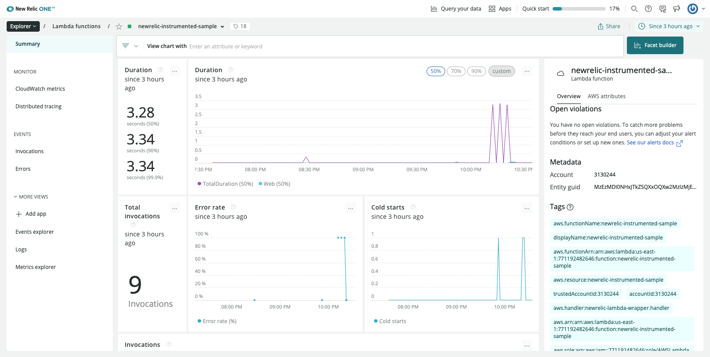

# New Relic Instrumented Lambda Sample

This project demonstrates how to set up lambda to connect to New Relic using Terraform.



## Prerequisites

- AWS Account
- New Relic Account
- Node.js
- [Terraform CLI](https://learn.hashicorp.com/tutorials/terraform/install-cli)
- [AWS CLI v2](https://docs.aws.amazon.com/cli/latest/userguide/install-cliv2.html) installed and configured using aws configure.
- [Python](https://www.python.org/downloads/) version 3.3 or higher installed.
- [newrelic-lambda CLI](), which you can install by running `pip install newrelic-lambda-cli`.
- An AWS account with permissions for creating IAM resources, managed secrets, and Lambdas. You also need permissions for creating CloudFormation stacks and S3 buckets. Here is the [Permissions details](https://docs.newrelic.com/docs/serverless-function-monitoring/aws-lambda-monitoring/enable-lambda-monitoring/account-linking/)

## Setup

### 1. Configure `AWS_PROFILE`

By default, the AWS CLI uses the `default` profile. You can create and use additional named profiles with varying credentials and settings by specifying the `--profile` option and assigning a name. You can skip this process if you want to go with `default` profile and skip `export AWS_PROFILE=MY_PROFILE` command for the rest of the instruction

```bash
$ aws configure --profile MY_PROFILE
AWS Access Key ID [None]: AKIAI44QH8DHBEXAMPLE
AWS Secret Access Key [None]: je7MtGbClwBF/2Zp9Utk/h3yCo8nvbEXAMPLEKEY
Default region name [None]: us-east-1
Default output format [None]: text
```

### 2. Connect AWS to New Relic

1. Go to one.newrelic.com > Infrastructure > AWS
2. Click **Set up Amazon Web Services integrations** (first time) or **Add an AWS account** (when adding another account)
3. Select **Use metric streams**
4. Follows the instruction on the page

### 3. Create CloudWatch Log Injestion Lambda and Secrets Manager

Note: Lambda extension (layer) now supports log and telemetry data which are directly sent to New Relic, so `newrelic-log-ingestion` lambda is not needed for your instrumented Lambda monitoring purpose. Secrets Manger and associated IAM Policy can also be created manually. You can either choose **newrelic-lambda appoach** or **manual step**

**Newrelic-lambda Appoach**

1. Go to one.newrelic.com > More > AWS Lambda Setup
2. Click **Set up AWS Lambda**
3. Follow the instruction. Eventually you will execute the following:

    ```bash
    # set AWS Profile
    export AWS_PROFILE=MY_PROFILE
    # create newrelic-log-ingestion lambda and secrets key in Secrets Manager
    newrelic-lambda integrations install \
      --nr-account-id [NR_ACCOUNT_ID] \
      --nr-api-key [NR_API_KEY]
    ```

    The `newrelic-lambda` CLI adds your New Relic license key as a secret in [AWS Secret Manager](https://aws.amazon.com/secrets-manager/) for greater security.

**Manual Approach**

1. Go to **AWS Secrets Manager** console and click **Store a new secret**

    - **Type**: Other type of secrets
    - **Secret name**: NEW_RELIC_LICENSE_KEY
    - **Secret value**: { "LicenseKey": [NR_LICENSE_KEY] }
    - **Encryption key**: default or anything you like
    - **Secret description**: The New Relic license key, for sending telemetry

    Note: Copy ARN of your secret key which is used in the next step

2. Go to **AWS IAM** console > Policies and click **Create policy**

    - **Policy name**: NewRelic-ViewLicenseKey-us-east-1<br>
        Note: policy name must be the following format. Only replace the region part if your lambda is deployed other than `us-east-1`
    - **Policy**:<br>
        Note: Replace the following `Resource` section with your ARN of your secret key<br>
        ```json
        {
          "Version": "2012-10-17",
          "Statement": [
            {
              "Sid": "VisualEditor0",
              "Effect": "Allow",
              "Action": "secretsmanager:GetSecretValue",
              "Resource": "arn:aws:secretsmanager:us-east-1:0000000000:secret:NEW_RELIC_LICENSE_KEY-xxxxx"
            }
          ]
        }
        ```

3. Go to **AWS IAM** console > Roles and click `AWSLambdaBasicExecutionRole` or any custom role for lambda which you might create in the next section and attache the above policy, so lamda can read the `[NR_LICENSE_KEY]` from Secrets Manager

### 4. Deploy Your Lambda (Instrumented Lambda)

1. Create `AWSLambdaBasicExecutionRole` or any custom role for Lambda which has at least the following minimum permission:
    ```json
    {
      "Version": "2012-10-17",
      "Statement": [
        {
          "Sid": "",
          "Action": "logs:*",
          "Effect": "Allow",
          "Resource": "*"
        }
      ]
    }
    ```
2. Configure `_terraform/vars.tf`
    - **aws_account_id**: use your AWS account ID (i.e. 1234567890)
    - **aws_region**: specify AWS region where you deployed `newrelic-log-ingestion` lambda
    - **newrelic_account_id**: use yours
    - **app_name**: this will be the lambda name
    - **lambda_runtime**: always good to use the latest stable version
    - **lambda_role_name**: set lambda role name (i.e. `AWSLambdaBasicExecutionRole`)
3. Deploy Lambda
    ```bash
    # Set AWS Profile
    export AWS_PROFILE="xxxxxxxxx"
    # Deploy
    bash ./deploy.sh
    ```
4. Install New Relic SDK Lambda Layer
    ```bash
    # Add lambda layer to your function:
    newrelic-lambda layers install \
      -f [LAMBDA_NAME] \
      --nr-account-id [NR_ACCOUNT_ID] \
      --nr-api-key [NR_API_KEY] \
      --enable-extension-function-logs
    ```
    This will add the following **Environment variables** in your instrumented lambda:
    - NEW_RELIC_EXTENSION_SEND_FUNCTION_LOGS: true
    - NEW_RELIC_LAMBDA_EXTENSION_ENABLED: true
5. Execute lambda
6. Go to one.newrelic.com > Explorer > [LAMBDA_NAME]

### 5. Remove Your Lambda (Instrumented Lambda) and CloudWatch group

```bash
# Set AWS Profile
export AWS_PROFILE="xxxxxxxxx"
# Destroy
bash ./destroy.sh
```
